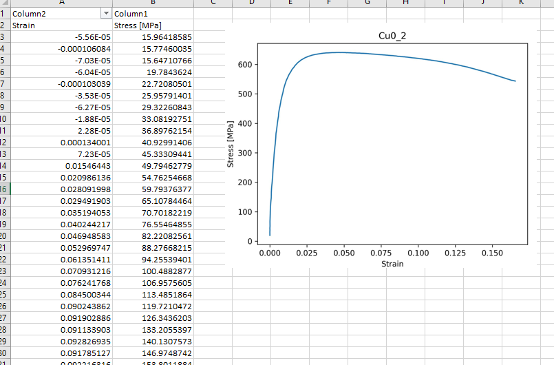

# Uniaxial Tensile Test Data Analysis 
> Correlation of force and DIC strain data, calculation of basic mechanical properties, ie. UTS, YS, E, etc.

## Table of Contents
* [General Info](#general-information)
* [Technologies Used](#technologies-used)
* [Features](#features)
* [Screenshots](#screenshots)
* [Setup](#setup)
* [Usage](#usage)
* [Project Status](#project-status)
* [Room for Improvement](#room-for-improvement)
* [Acknowledgements](#acknowledgements)
* [Contact](#contact)
<!-- * [License](#license) -->

## General Information
- This project correlates data from Zwick Z005 universal testing machine and custom DIC system .
- This project retrieves user's list of samples, runs correlation and calculations for each one.
- The output is stress-strain curve in .csv and graph in .jpg for each sample, a table with basic mechanical properties for samples series in .csv.   

## Technologies Used
- Python 3.10
- numpy 1.25.0
- matplotlib 3.7.1

## Features
The project:
- calculates strain based on data from VIC2D software
- calculates stress based on force on rectangular cross section of a sample
- given the frequency of DIC recording, it adjusts stress array to strain records (stress recording frequency is set as 10 Hz)
- displays table with paramters for samples' list provided by user

## Screenshots
Stress-strain curve and image for a single sample. 

## Usage
To run program you need to provide files:
- .csv file with name, dimension a and dimension b of a sample. Name of the columns should be:
'Nazwa', 'a', 'b'
- .csv file with cooridnates from VIC2D software of two points, where strain along Y axis is described by columns [1] and [4] 
- .TRA file from Zwick Z005 universal testing machine
- frequency of DIC recording

To run program, you need to place files in the same folder as .py files, open main.py, give DIC frequency. 

## Project Status
Project is: _in progress_ 

## Room for Improvement
Include areas you believe need improvement / could be improved. Also add TODOs for future development.

Room for improvement:
- Improvement to be done 1
- Improvement to be done 2

To do:
- Feature to be added 1
- Feature to be added 2

## Acknowledgements
Give credit here.
- E and YS calculations were based on: https://professorkazarinoff.github.io/Engineering-Materials-Programming/07-Mechanical-Properties/mechanical-properties-from-stress-strain-curves.html

